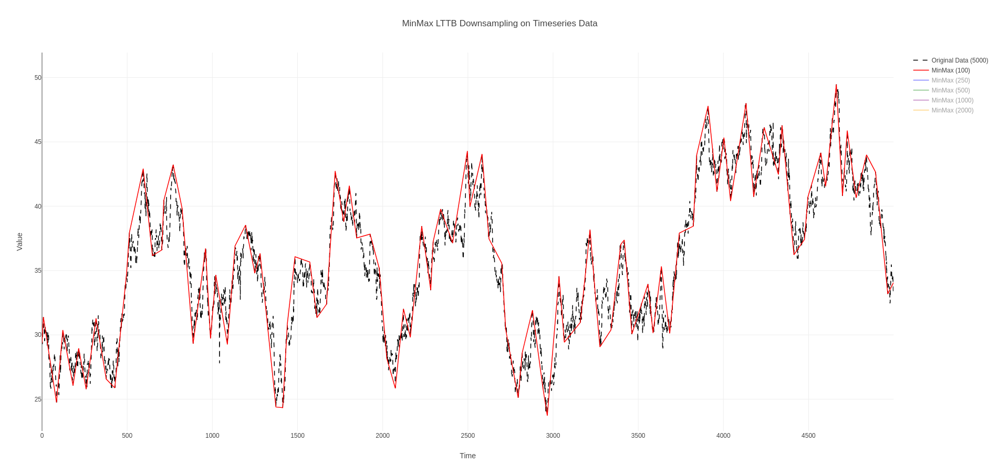
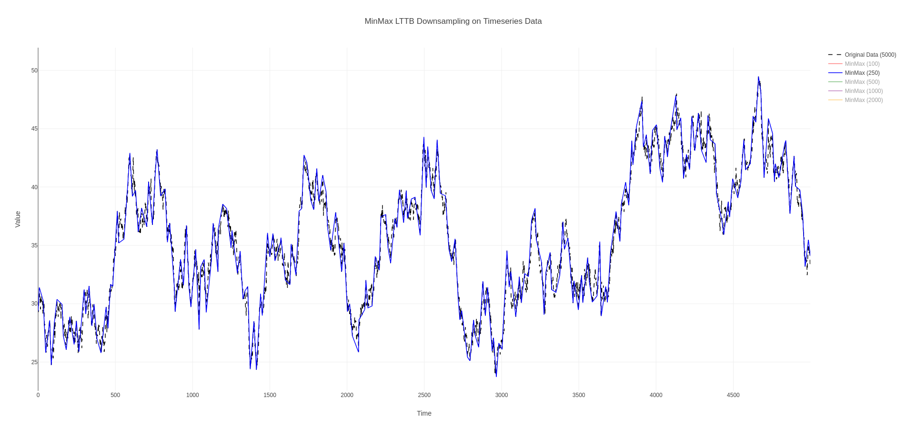
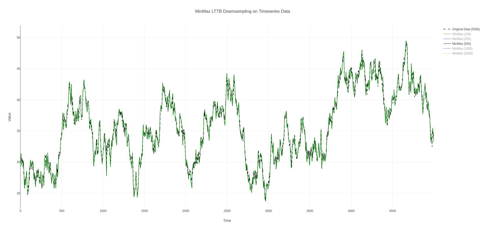
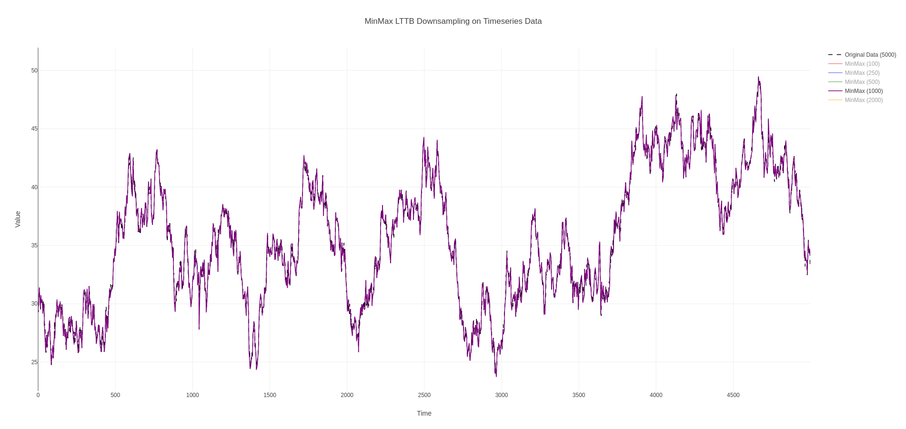

# MinMaxLTTB

[](https://crates.io/crates/minmaxlttb)
[](https://docs.rs/minmaxlttb)
[](https://github.com/andrei-ng/minmaxlttb/actions/workflows/build.yml)

A Rust crate for downsampling timeseries data using the LTTB (Largest Triangle Three Buckets) and MinMaxLTTB algorithms.

The classic LTTB algorithm is implemented as described in the original paper [Downsampling Time Series for Visual Representation](https://skemman.is/bitstream/1946/15343/3/SS_MSthesis.pdf). 
The MinMaxLTTB algorithm follows [MinMaxLTTB: Leveraging MinMax-Preselection to Scale LTTB](https://arxiv.org/abs/2305.00332).

The crate draws inspiration from other implementations of LTTB and its variants 
 - https://github.com/jeromefroe/lttb-rs
 - https://github.com/predict-idlab/MinMaxLTTB
 - https://github.com/predict-idlab/tsdownsample
 - https://github.com/cpbotha/lttb-bench/

## Variants

- **Classic LTTB**: Classic implementation of LTTB downsampling with bucket binning based on equal count of points
- **Standard LTTB**: Alternative implementation of LTTB downsampling with bucket binning based on equidistant x-range for all buckets  
- **MinMax LTTB**: MinMax variant that preserves local minima and maxima and is more computationally efficient


The restriction on the input data is that points must represent a timeseries, with strictly monotonically increasing values of `x`.

## Usage

Add to your `Cargo.toml`:

```toml
[dependencies]
minmaxlttb = "0.1.0"
```

```rust
use minmaxlttb::{Point, Lttb, LttbBuilder, LttbMethod, Binning};

// E.g., usage with convenience functions
let points = vec![
    Point::new(0.0, 1.0),
    Point::new(1.0, 2.0),
    Point::new(2.0, 3.0),
    Point::new(3.0, 4.0),
];

// Classic LTTB (equal-count buckets)
let classic = minmaxlttb::lttb(&points, 3, Binning::ByCount).unwrap();

// Standard LTTB (equal x-range buckets)
let standard = minmaxlttb::lttb(&points, 3, Binning::ByRange).unwrap();

// Advanced usage with builder pattern, e.g., using MinMax LTTB with ratio=3
let lttb = LttbBuilder::new()
    .threshold(3)
    .method(LttbMethod::MinMax)
    .ratio(3)
    .build();

let result = lttb.downsample(&points).unwrap();

// Reuse the same configuration for multiple datasets
let dataset1 = vec![Point::new(0.0, 10.0), Point::new(1.0, 20.0), Point::new(2.0, 30.0), Point::new(3.0, 40.0)];
let dataset2 = vec![Point::new(0.0, 30.0), Point::new(1.0, 40.0), Point::new(2.0, 50.0), Point::new(3.0, 60.0)];

let lttb = LttbBuilder::new()
    .threshold(3)
    .method(LttbMethod::Classic)
    .build();

let result1 = lttb.downsample(&dataset1).unwrap();
let result2 = lttb.downsample(&dataset2).unwrap();
```

## Examples

Check the `examples` directory for examples that generate plots using the `plotly-rs` crate and are rendered in your system's default browser:
 - power: example of downsampling a real-world power consumption dataset with MinMaxLTTB
 - timeseries: example of downsampling a synthetic dataset with classic LTTB
 - minmax_vs_classic: comparison of LTTB and MinMaxLTTB downsampling
 - minmaxlttb_analysis: a visual analysis of the point selections and bucket/partition division for the MinMaxLTTB algorithm


Run any of the examples by using one of the commands 
```Bash
cargo run -p example_timeseries --release
```

```Bash
cargo run -p example_power --release
``` 


```Bash
cargo run -p example_minmax_vs_classic --release
``` 

```Bash
cargo run -p example_minmaxlttb_analysis --release -- --show-buckets=on --show-partitions=on --show-min-max=on --show-selected=on --show-next-vertices=on --ratio=4
``` 

## Result of MinMaxLTTB on 5.000-point timeseries

Below images show the effects of downsampling a 5.000-point timeseries with MinMaxLTTB with different thresholds.

The plots have been exported from the `timeseries` example using the `--method minmax` argument
```Bash
cargo run -p example_timeseries -- --method minmax
```








## License

MIT 